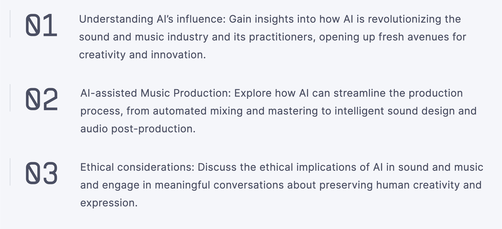
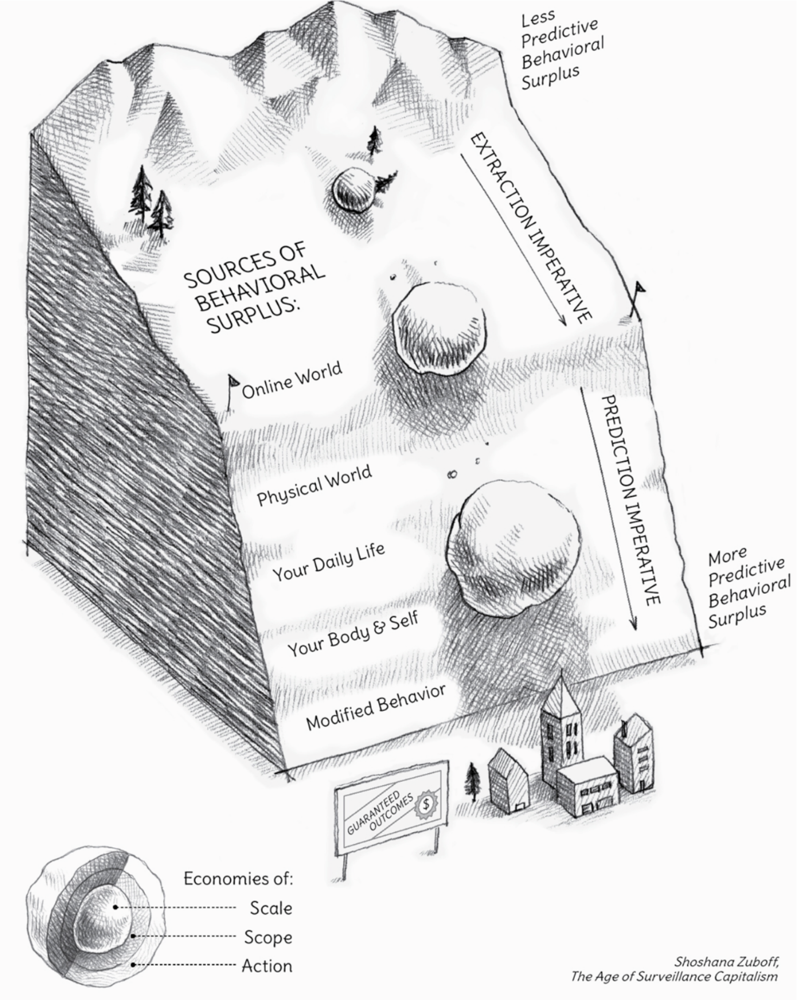

<!-- Slide number: 1 -->

# Music and AI: Embedded (and Embodied)

Cumhur Erkut, cer@create.aau.dk

Associate Professor, Dr. Sc. (Tech)

https://cerkut.github.io

### Based on August’23 RMC workshop

## Principles of AI Disruption 

2.1 A new technology is accepted in production in one of the following ways: a) ``replacement, b) ``insertion, and c) ``disruption (point of no return).

2.2 AI-assisted (music) production currently proposes value by a) and b). It is not a disruptive yet.

2.3 A disruptive technology is accepted if and only if (iff) when its value proposition is significantly higher than the risks.

## Example: Birth of Modern Music Production

"A disruption" by Cumhur Erkut is licensed under CC BY-SA

### Notes:

In the case of Kind of Blue there were two producers: Teo Macero and Irving Townsend”, said jazz historian Eric Nisenson.

<!-- Slide number: 4 -->

## But the disruption is near

Besides sound and music, the living **individual body or social bodies** are the final frontiers for big data and deep learning!

According to Zuboff, economies of scale, scope, and action are forms of harm. 

* **Economies of scale**: cost advantages when producing in large quantities.
* **Economies of scope**: cost advantages when producing variety 
* **Economies of action**: cost advantages when companies use their market power to influence the behavior of other companies.

### Notes:

<!-- Slide number: 5 -->

### Notes:

See also https://github.com/AI-Guru/music-generation-research (stopped in 2023)!

<!-- Slide number: 6 -->

# VR / Tangible HCI Rehabilitation

### TODO Notes: bullets and items from this point onwards

Example 1:

<!-- Slide number: 7 -->

https://audiobox.metademolab.com

<!-- Slide number: 8 -->

Snapshot of SIGGRAPH 97 demo

DIVA is a collaborative research group of the following topics:
* Real-time automatic character animation
* Interaction through motion analysis, especially conductor following.
* Sound generation with physical instrument models
* Acoustics modelling and auralization
* EVE - The Experimental Virtual Environment

DIVA - Digital Interactive Virtual Acoustics (‘98 Arrival to Finland, ’13 to Denmark )

### Notes:

<!-- Slide number: 9 -->

# Neural Nets from scratch (Python was not invented :-)

### Notes:

<!-- Slide number: 10 -->

ANNs as optimizers

### Notes:

Also a clear timeframe table would be nice?

<!-- Slide number: 11 -->

https://web.archive.org/web/20170305231733/http://silakka.fi/compositions/pcm-035553/

### Notes:

<!-- Slide number: 12 -->

https://web.archive.org/web/20170305231733/http://silakka.fi/compositions/pcm-035553/

### Notes:

<!-- Slide number: 13 -->

https://web.archive.org/web/20170305231733/http://silakka.fi/compositions/pcm-035553/

### Notes:

<!-- Slide number: 14 -->

Snapshot of SIGGRAPH 97 demo

DIVA is a collaborative research group of the following topics:
Real-time automatic character animation
Interaction through motion analysis, especially conductor following.
Sound generation with physical instrument models
Acoustics modelling and auralization
EVE - The Experimental Virtual Environment

DIVA - Digital Interactive Virtual Acoustics (‘98 Arrival to Finland, ’13 to Denmark )

### Notes:

<!-- Slide number: 15 -->

# Multisensory Experience Lab (CPH, DK)

<!-- Slide number: 16 -->

A computer program is said to learn from experience E with respect to some class of tasks T and performance measure P, if its performance at tasks in T, as measured by P, improves with experience E.

### Notes:

Machine Learning is the training of a model from data that generalizes a decision against a performance measure.

<!-- Slide number: 17 -->

### Notes:

Machine Learning is the training of a model from data that generalizes a decision against a performance measure.

<!-- Slide number: 18 -->

] Engel, J., Hantrakul, L., Gu, C., & Roberts, ADDSP: Differentiable Digital Signal Processing, In, Proc. ICLR (2020)

# 2019

### Notes:

The differentiability allows us to use domain specific-expertise in sound, music, and (even possibly in the future movement computing), since the dawn of digital computers. Running an encoder / decoder at the front end, and it calculates f0 and general loudness, and further breaks down the decoded signal to harmonic & filtered noise components, plus a convolution-based reverberator. All the DSP is done feedforward filters in the frequency domain. The differentiability allows us to use domain specific-expertise in sound, music, and (even possibly in the future movement computing), since the dawn of digital computers. Running an encoder / decoder at the front end, and it calculates f0 and general loudness, and further breaks down the decoded signal to harmonic & filtered noise components, plus a convolution-based reverberator. All the DSP is done feedforward filters in the frequency domain.

<!-- Slide number: 19 -->

# Deployment: Audio Plugins

### Notes:

This is our deployment target.

<!-- Slide number: 20 -->

# Example: VST, AU, and other plugins

<!-- Slide number: 21 -->

https://lh3.googleusercontent.com/wkmQM4waAjsFw056qS0VCj5UcvooLLUI5_EwhaCrx6i69M5qu6BicY6TlhXcd6tYDd6_JHE3u7av9ImohJ2XIJy2tIVm3nqChBuA=w2048-rw-v1

The BIG Dream:Differentiable Neural Audio Computing as a Foundation Model? (Graves et al, 2016)

### Notes:

Return to mother ship of DeepMIND!
I usually tell my students that DSP is all about memory access, and simple arithmetic, but possibly with complex numbers  What if we embed E2E learning into domain-specific programming?

<!-- Slide number: 22 -->

# Example 1: Resurrecting the Tromba Marina

### Notes:

<!-- Slide number: 23 -->

# Example 2: Generative Choreographies

### Notes:

Kaspersen, Esbern, Dawid Górny, Cumhur Erkut, and George Palamas. 2020. “Generative Choreographies: the Performance Dramaturgy of the Machine.” In, nil. doi:10.5220/0008990403190326.
https://github.com/dawidgorny/dance2dance
https://dawidgorny.com/

<!-- Slide number: 24 -->

### Notes:

The differentiability allows us to use domain specific-expertise in sound, music, and (even possibly in the future movement computing), since the dawn of digital computers. Running an encoder / decoder at the front end, and it calculates f0 and general loudness, and further breaks down the decoded signal to harmonic & filtered noise components, plus a convolution-based reverberator. All the DSP is done feedforward filters in the frequency domain. The differentiability allows us to use domain specific-expertise in sound, music, and (even possibly in the future movement computing), since the dawn of digital computers. Running an encoder / decoder at the front end, and it calculates f0 and general loudness, and further breaks down the decoded signal to harmonic & filtered noise components, plus a convolution-based reverberator. All the DSP is done feedforward filters in the frequency domain.

<!-- Slide number: 25 -->

# Impact at Aalborg University

Boris Kuznetsov: Differentiable IIR Filters For Machine Learning Applications, MSc Thesis, 2020 (with J. Parker)
Christie Laurent: Model-based Analysis and Synthesis of Aging Effects on Human Voice Production, MSc Thesis, 2020
Ganis, Knudsen, Lyster, Otterbein, Südholt, and Erkut. 2021. “Real-Time Timbre Transfer and Sound Synthesis using DDSP.” In Proc. Sound and Music Computing Conf., https://doi.org/10.5281/zenodo.5043235
Alonso, Juan, and Cumhur Erkut. 2021. “Explorations of Singing Voice Synthesis Using DDSP.”  In Proc. Sound and Music Computing Conf., https://doi.org/10.5281/zenodo.5043851.
Juan Alonso: Differentiable FM synthesis: Applications to Timbre transfer and Latent space, MSc Thesis, 2021: https://juanalonso.github.io/ddsp_fm/
2020-2021

<!-- Slide number: 26 -->

# Example: Parametric Latent Space in Differentiable FM Sytnhesis (Alonso’21)

<!-- Slide number: 27 -->

# Impact at Aalborg University

Parametric Tuning of Extended Reverberation Algorithm Using Neural Networks, Søren Vøgg Krabbe Lyster
Vocoding with Differentiable Digital Signal Processing: Development of a Real-Time Vocal Effect Plugin, David Südholt
Design, Development and Evaluation of Differentiable Max Objects for Real-time Neural Sound Synthesis and Timbre Transfer using Differentiable Digital Signal Processing, Robin Otterbein
Pruning Deep Neural Network Models of Guitar Distortion Effects”, David Südholt, Alec Wright, Cumhur Erkut, and Vesa Välimäki, IEEE Transactions on Audio, Speech and Language Processing, December 2022
ImprovAIze: Using deep learning to improve real-time motion recognition and affective experiences for human-machine interaction (Jochum, Erkut, Dahl, Overholt, Palamas, Bai, and Otterbein)

2022

<!-- Slide number: 28 -->

# Three pillars of ML lifecycle: Model, Data, and Code

### Notes:

This is our definition in teacthing.

<!-- Slide number: 29 -->

### Notes:

<!-- Slide number: 30 -->

# Three pillars of ML lifecycle: Model, Data, and Code

<!-- Slide number: 31 -->

# Three pillars of ML lifecycle: Model, Data, and Code

Communities

### Notes:

<!-- Slide number: 32 -->

# Three pillars of ML lifecycle: Model, Data, and Code

### Notes:

in an article published in 2020 by Algorithmia, unreasonably long model deployment timelines were unveiled, in which only 14% of the surveyed companies can manage the deployment of a new model to production in under 7 days, 35% of the surveyed companies would need at least 3 months. There are still companies that require years. Adopting model deployment principles early on can eliminate this showstopper entirely. So what are the model deployment principles? We focus on the tools, but principles?

<!-- Slide number: 33 -->

https://github.com/archinetai/audio-ai-timeline

### Notes:

<!-- Slide number: 34 -->

https://mattturck.com/mad2024

### Notes:

https://mattturck.com/mad2024

<!-- Slide number: 35 -->

NSynth+
Sensel Morph
NVIDIA Jetson Nano
Moog Studio, with Moog and Generative Deep Learning Playing Cards
NVIDIA
Jetson
Orin
SpaceMouse
Uno Hybrid Synth
ZED 2 Depth
Genelec Speakers
Studio One with Setup Memory
3D Lazer Projector
HTC Vive Pro

<!-- Slide number: 36 -->

<!-- Slide number: 37 -->

<!-- Slide number: 38 -->

# Our MLOps: Bridging AI and X-verse with ∂-models

### Notes:

Differentiable programming not elaborated until here. Check the process at FB with Kotlin?

<!-- Slide number: 39 -->

# Our MLOps? Karpathy (SW 2.0) +  HCI (IxD) + Academia

Lones, Michael A. 2021. “How to Avoid Machine Learning Pitfalls: A Guide for Academic Researchers.” arXiv. https://doi.org/10.48550/arxiv.2108.02497

Scott H. Hawley @drscotthawley
Here are slides from my talk @acousticsorg: "Development tools for deep learning models of acoustical signal processing" https://hedges.belmont.edu/ml-audio-dev-tools.pdf…

Kreuzberger, Dominik, Niklas Kühl, and Sebastian Hirschl. 2022. “Machine Learning Operations (MLOps): Overview, Definition, and Architecture.” CoRR.
Tamburri, Damian A. 2020. “Sustainable MLOps: Trends and Challenges.” 2020 22nd International Symposium on Symbolic and Numeric Algorithms for Scientific Computing (SYNASC) 00: 17–23. doi:10.1109/synasc51798.2020.00015.

<!-- Slide number: 40 -->

NOW
Future
Scott H. Hawley @drscotthawley
https://hedges.belmont.edu/ml-audio-dev-tools.pdf

<!-- Slide number: 41 -->

### Notes:

https://github.com/abargum/pitch-enc

<!-- Slide number: 42 -->

# Embedded and embodied: DJs and Virtuoses of AI

This Photo by Unknown Author is licensed under CC BY-SA
https://paperswithcode.com/area/audio

Şimşekli, Umut, Antti Jylhä, Cumhur Erkut, and A T Cemgil. “Real-Time Recognition of Percussive Sounds by a Model-Based Method.” EURASIP Journal on Advances in Signal Processing 2011 (1): 291860.

