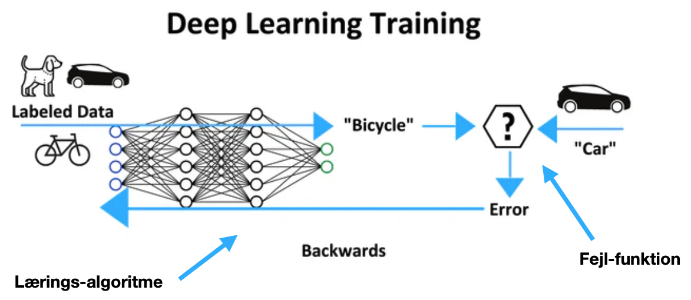

# AI-Music-Instrument-Workshop 9:00

## How everything started: Early machine learning / instruments
- https://historyofcomputers.eu/timelines/history-of-computers-a-brief-timeline/ 
- Perceptron: https://en.wikipedia.org/wiki/Perceptron
- Explainer: https://mlu-explain.github.io/
- A path: http://www.tml.hut.fi/Research/DIVA/past/
- Try out: https://docs.edgeimpulse.com/workshops 

### Where are we now
- https://semilla.ai/
- https://neutone.ai/
- https://fugatto.github.io/
- Research (until 2023) July: https://github.com/AI-Guru/music-generation-research
  - Another timeline: https://github.com/archinetai/audio-ai-timeline 
  - Acquiring more technical debt on the go: https://mattturck.com/mad2024 
  

## Onto Deep Learning (Discriminative, Generative)

- https://playground.tensorflow.org/
    - [ ] Tinker with the defalult example: What are features, learning rate, activation functions?
    - [ ] Challenge: Can you create a neural network that only uses the first 2 features as input, and linear as the activation function?
  
    - Exit: Check around tensorflow @ https://www.tensorflow.org/ (Main tool for Magenta)

### NSynth + Magenta Family 

- Explore https://magenta.tensorflow.org/get-started
- Find NSynth Explorer at the Web Applications: https://magenta.tensorflow.org/demos/web/ , try it out
- Main: https://magenta.tensorflow.org/nsynth
- Check https://magenta.tensorflow.org/nsynth-instrument If you have Ableton Live or Max/MSP, download the plugin, experiment with the grid. If not, try other web apps.

### Magenta Studio 
- Download Magenta Studio https://magenta.tensorflow.org/studio (If you have Ableton Live, the plugin version, if not the standalone)
- Make sure to experiment with all 5 tools: [Continue](https://magenta.tensorflow.org/studio/standalone#continue), [Groove](https://magenta.tensorflow.org/studio/standalone#groove), [Generate](https://magenta.tensorflow.org/studio/standalone#generate), [Drumify](https://magenta.tensorflow.org/studio/standalone#drumify), and [Interpolate](https://magenta.tensorflow.org/studio/standalone#interpolate). 

## Generative AI for Audio

- https://paperswithcode.com
  - https://paperswithcode.com/task/audio-generation 
### Explainers
- https://poloclub.github.io

## Tone Transfer
- Magenta's DDSP: https://magenta.tensorflow.org/ddsp-vst
  - DDSP models by its authors: https://drive.google.com/drive/folders/1o00rBOLPNEZWURCimK_QQWpvR8iWVeK5
- RAVE: https://forum.ircam.fr/search/?topics=RAVE 
- DDSP + TikTok-like morphing: https://mawf.io/
- FluComa https://learn.flucoma.org/ 
- 🔥 **Neutone**: https://neutone.ai/ (Watch the video below for an introduction, or [visit the dedicated page](morpho.md).

### Current GenAI amd Large Language Models (LLMs) applied to Music

* Google Music LM: https://google-research.github.io/seanet/musiclm/examples/
* Meta AudioCraft: https://audiocraft.metademolab.com/
* Web UI for LLMs https://sonauto.ai
* 🔥 https://fugatto.github.io/ 

# What is hot

## Classical Electronic Music for Modern AI

🚀 [Juan Alonso Moreno](https://github.com/juanalonso) has developed a differentiable FM synthesizer using the DDSP framework in his 2021 SMC Master thesis 

- Audio [https://juanalonso.github.io/ddsp_fm/](https://juanalonso.github.io/ddsp_fm/)
- Code [https://juanalonso.github.io/ddsp_fm/](https://github.com/juanalonso/ddsp_fm)

[Franco Caspe](https://fcaspe.github.io/), a PhD student from QMUL has interesting related projects. There is a [new book and repo](https://github.com/yeeking/ai-enhanced-audio-book) by Yee-King you can use to combine the power of deep learning and the real-time capabilities of the JUCE platform.

💿 DATA: Miller S Puckette [in his Pd Repertory Project](https://msp.ucsd.edu/pdrp/) provides example study patches of important electronic / computer music projects. [Stefano Fasciani (U. Oslo)](https://github.com/stefanofasciani/DGMD) is actively working on a dataset generator for musical devices. 

Starting from these models 🚀 and data 💿, can you design and evaluate an end-to-end differentiable synthesizer? 

## Quantum Sound and Music Computing
Denmark has a rich history of innovation in Quantum research, and aims to a big player in Quantum Computing. There is a [growing community, a national strategy, talent programs, and resources available](https://dqc.dk/) for the next generation of Quantum Computing and Quantum Machine Learning professionals. Outside of Denmark, startups like [Moth Quantum](https://mothquantum.com/) strive to enable the next era of music, gaming and the arts with quantum computing technology.

 Image linked from https://refikanadol.com/works/quantummemories/  
 
 

**Objective**: Explore the intersection of quantum and creative computing in sound and music, focusing on the development of new musical instruments and compositions.

# Other topics

## Music making & production systems

### AIVA 

- Main: https://aiva.ai/
- Release discord: https://discord.com/channels/595651381860368384/596767903215255572
- Tutorial list @ YouTube
  https://www.youtube.com/watch?v=SR-UWkSTmAQ&list=PLv7BOfa4CxsHp4uDdsmZgpdclrwkdMpOe

#### AIVA TODO

- Check Terms and Conditions and create an account
- Generate 3 versions of a compositions on the web interface
- Open the best one in Editor and edit to improve
- Use an influence, repeat to last steps above for another composition
- Identify the Model / Data / Code structure
- Show and tell: including influence and ethics
- Download your work as MIDI (we'll use in 1.3 onwards)

### 2.4 DAW Plugins

- Main: https://interactiveaudiolab.github.io/project/audacity.html
- Download special build of audactiy (Mac only ???)
- Try Usage Example - Upmixing and Remixing with Source Separation with your favorite audio file
- Try adding vocals to your AIVA composition. We have to match the pitch, tempo, harmony, or other attributes with effects.

